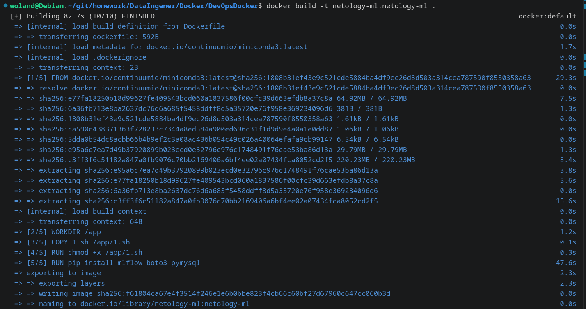
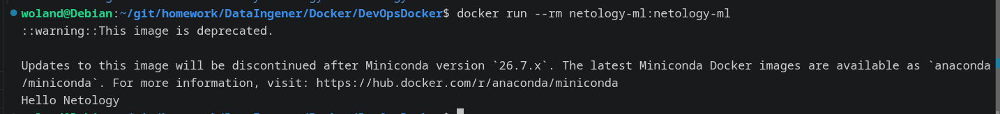

# Домашняя работа к занятию “Docker и микросервисная архитектура” - Барышкво Михаил

## Задание:

Необходимо сделать dockerfile для получения рабочего контейнера.

1.    В качестве основы, берём образ continuumio/miniconda3:latest
2.    Добавляем и делаем рабочей папкой /app
3.    Создаём простой sh файл с названием 1.sh, который должен выдавать надпись “Hello Netology”.
4.    Надо скопировать этот файл внутрь контейнера и выдать ему права на исполнение.
5.    Запустить установку пакетов python mlflow boto3 pymysql.
6.    В конце запустить на вывод файл 1.sh.
7.    После чего собрать через docker build контейнер с тегом netology-ml:netology-ml

Домашнее задание выполните в файле readme.md в github репозитории.


## Решение

### Создание файла 1.sh:

```bash
#!/bin/bash
echo "Hello Netology"
```

### Создание Dockerfile:
```dockerfile
FROM continuumio/miniconda3:latest
WORKDIR /app
COPY 1.sh /app/1.sh
RUN chmod +x /app/1.sh
RUN pip install mlflow boto3 pymysql
CMD ["/app/1.sh"]
```


### Сборка Docker образа
```bash
docker build -t netology-ml:netology-ml .
```


### Запуск контейнера
```bash
docker run --rm netology-ml:netology-ml
```

